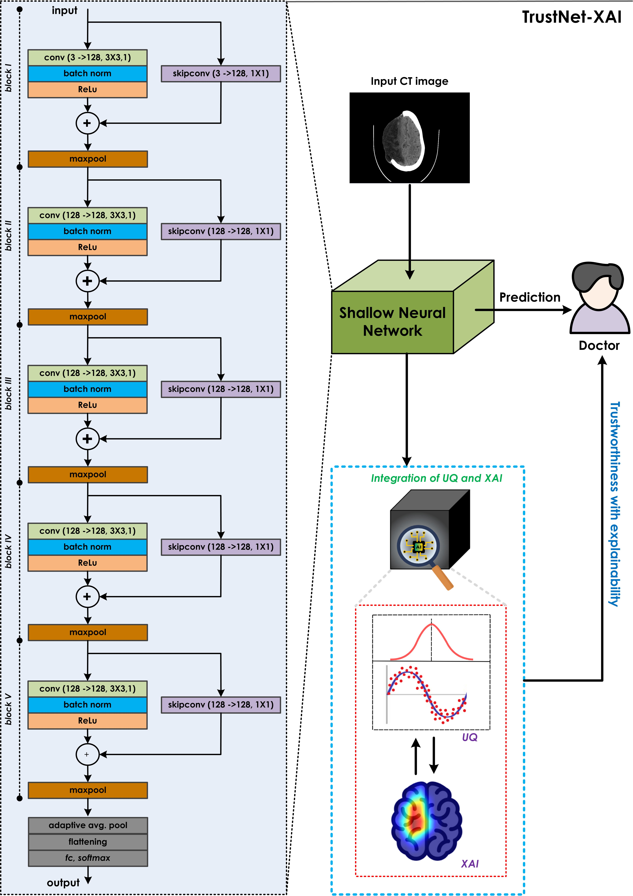

<table>
  <tr>
    <td width="60%">

### TrustNet – Reliable AI for Stroke Detection

Diagnosing ischemic stroke from Computed Tomography  images is a highly challenging and detailed process that requires precise and careful analysis by a
medical professional. Deep Learning techniques offer an effective solution to this
issue because of their remarkable performance. Nevertheless, most of those methods
still lack the Uncertainty Quantification and eXplainable Artificial Intelligence features, which are essential for clinical practice and acceptance. 
We present
TrustNet, a small but powerful Convolutional Neural Network (0.66 MB) that uses
Monte Carlo dropout and quantitative Grad-CAM. This technique helps visualize the
issues related to two independent factors: uncertainty in the model's classification
and inconsistency in recognizing the relevant visual features. The model was
validated on a set of 2023 brain CT scans and compared with networks that are generally used for classification purposes. TrustNet was able to achieve an accuracy
of 94.67%, with 100% specificity, 91.6% sensitivity, and 100% precision, competing
against various conventional architectures. The introduction of the UQ and XAI
methods led to a consistent performance enhancement over the baseline models by
limiting the number incorrect predictions, which is crucial for stroke diagnosis. With
this performance, our approach can also provide an explanation for the reasoning and estimate confidence, which is essential for model deployment. This method is an indispensable tool for eliminating diagnostic bias and thus controlling the safety of AI
in the clinical workflow.

  </td>
    <td width="40%">
      
    </td>
  </tr>
</table>

